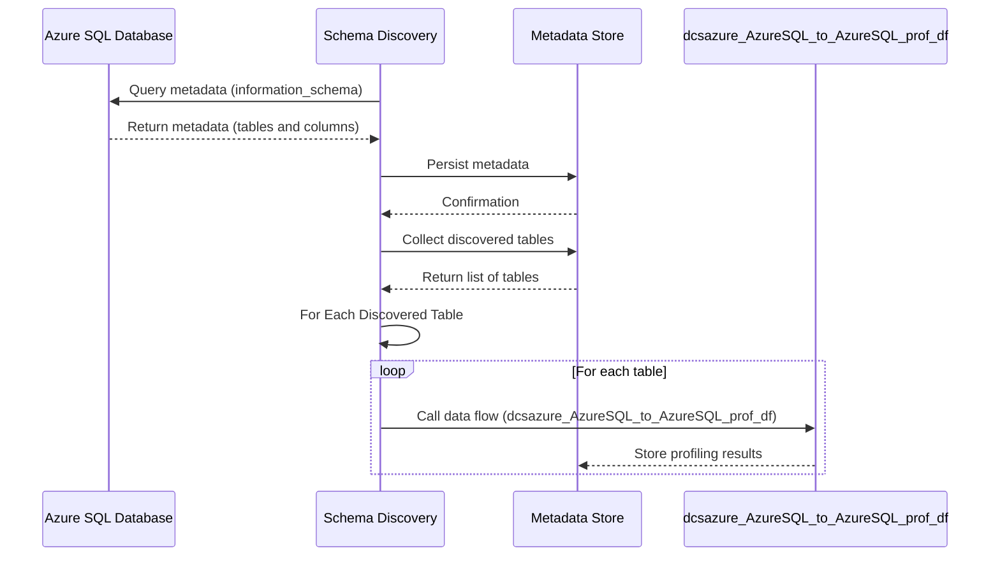

# dcsazure_AzureSQL_to_AzureSQL_prof_pl
## Delphix Compliance Services (DCS) for Azure - AzureSQL to AzureSQL Profiling Pipeline

This pipeline will perform automated sensitive data discovery on your AzureSQL Instance.

### Prerequisites
1. Configure the hosted metadata database and associated Azure SQL service (version `V2024.01.01.0`+).
1. Configure the DCS for Azure REST service.
1. Configure the AzureSQL linked service.

### Importing
There are several linked services that will need to be selected in order to perform the profiling of your AzureSQL 
instance.

These linked services types are needed for the following steps:

`AzureSQL` (source) - Linked service associated with unmasked AzureSQL data. This will be used for the following
steps:
* Schema Discovery From AzureSQL (Copy data activity)
* dcsazure_AzureSQL_to_AzureSQL_source_ds (AzureSQL dataset)
* dcsazure_AzureSQL_to_AzureSQL_prof_df/AzureSQLSource1MillRowDataSampling (dataFlow)

`Azure SQL` (metadata) - Linked service associated with your hosted metadata store. This will be used for the following
steps:
* dcsazure_AzureSQL_to_AzureSQL_metadata_prof_ds (Azure SQL Database dataset),
* dcsazure_AzureSQL_to_AzureSQL_prof_df/MetadataStoreRead (dataFlow),
* dcsazure_AzureSQL_to_AzureSQL_prof_df/WriteToMetadataStore (dataFlow)

`REST` (DCS for Azure) - Linked service associated with calling DCS for Azure. This will be used for the following
  steps:
* dcsazure_AzureSQL_to_AzureSQL_prof_df (dataFlow)

### How It Works

* Schema Discovery From AzureSQL
  * Query metadata from AzureSQL `information_schema` to identify tables and columns in the AzureSQL instance
* Select Discovered Tables
  * After persisting the metadata to the metadata store, collect the list of discovered tables
* For Each Discovered Table
  * Call the `dcsazure_AzureSQL_to_AzureSQL_prof_df` data flow

### Variables

If you have configured your database using the metadata store scripts, these variables will not need editing. If you
have customized your metadata store, then these variables may need editing.

* `METADATA_SCHEMA` - This is the schema to be used for in the self-hosted AzureSQL database for storing metadata
  (default `dbo`)
* `METADATA_RULESET_TABLE` - This is the table to be used for storing the discovered ruleset
  (default `discovered_ruleset`)

### Parameters

* `P_SOURCE_DATABASE` - String - This is the database in AzureSQL that contains data we wish to profile
* `P_SOURCE_SCHEMA` - String - This is the schema within the above source database that we will profile
