# Data Discovery Dataflow

The data discovery dataflow is used to profile data in a dataset. Since profiling requires data sampling, this dataflow
leverages Azure Data Factory's sampling on the source, then shuffles the data and consumes only a subset of the sampled 
data for the purposes of passing them to the DCS for Azure discovery API such that data can be profiled. The results of
sensitive data discovery are then persisted to the metadata store.

## Structure

The general flow of the data in the dataflow is as follows:

```mermaid
flowchart LR
    SourceData1MillRowDataSampling --> 
    CreateRandomIdColumn -->
    SortByRandomId -->
    CreateFinalSelectionId --> 
    GetRandomRows --> 
    CreateItemsList --> 
    CallDCSForAzureProfiling -->
    ParseAPIResponse -->
    AssertNoFailures --> 
    FlattenDetails --> JoinDetailsAndMetadata
    MetadataStoreRead --> 
    FilterRowsToUpdate -->
    JoinDetailsAndMetadata -->
    FilterOnlyNewlyProfiledRows -->
    UpdateProfiledColumns -->
    ChecksBeforeSave -->
    WriteToMetadataStore
```

* `SourceData1MillRowDataSampling` - Data Source - Import the first million rows of unmasked data from the
desired source dataset
* `CreateRandomIdColumn` - Derived Column - Add a `DELPHIX_COMPLIANCE_SERVICE_RANDOM_ID` column, which is
generated via the `random` expression. The current timestamp in milliseconds is used as the seed for the number
generation
* `SortByRandomId` - Sort - Sort the sample rows based on the randomly generated IDs
* `CreateFinalSelectionId` - Surrogate Key - Add a `DELPHIX_COMPLIANCE_SERVICE_FINAL_SELECTION_ID` column that
increments by `1` and starts at `1`. It is incremented in order of the `DELPHIX_COMPLIANCE_SERVICE_RANDOM_ID` added
previously, making it so that the surrogate key is in order of the randomly assigned value, creating a shuffled set of
rows
* `GetRandomRows` - Filter - Take the first `DF_NUM_ROWS_TO_PROFILE` from the shuffled row set 
* `CreateItemsList` - Aggregate - For every column that we didn't add `collect` it to produce a list of values
* `CallDCSForAzureProfiling` - External Call - Call DCS for Azure services, using `/v1/discovery/profileByColumn`,
where the data from the `CreateItemsList` is included in the request body and the format of the response is specified
* `ParseAPIResponse` - Parse - Parse the API response from profiling call
* `AssertNoFailures` - Assert - Confirm that we received a `200` response status from the API request
* `FlattenDetails` - Flatten - Unroll the API response body into `columnName`, `domain`, `algorithm`,
`confidence`, and `rowsConsidered`
* `MetadataStoreRead` - Data Source - Import data from Metadata Datastore, querying the ruleset table
* `FilterRowsToUpdate` - Filter - Filter ruleset table down to the table in question by specifying `dataset`,
`specified_database`, `specified_schema`, and `identified_table` - making sure they match the dataset associated with
each version of the dataflow, `DF_SOURCE_DATABASE`, `DF_SOURCE_SCHEMA`, and `DF_SOURCE_TABLE` (respectively). This
filters the ruleset down to only the columns that need to be profiled for this particular table
* `JoinDetailsAndMetadata` - Join - Inner join on `FlattenDetails` and `FilterRowsToUpdate` based on matching
column names
* `FilterOnlyNewlyProfiledRows` - Filter - Filter rows where the profiling results are different from previous
dataflow executions (i.e. the `profiled_domain`, `profiled_algorithm`, `rows_profiled`, `confidence_score` or
`row_count` have changed)
* `UpdateProfiledColumns` - Derived Column - Updating the column `last_profiled_updated_timestamp`
* `ChecksBeforeSave` - Alter Row - Alter rows using `Update if` (only update rows that need updating)
* `WriteToMetadataStore` - Sink - Sink results of profiling to metadata data store by sinking the unrolled
results of the profiling call to the appropriate columns in the metadata store