# Filtered Masking Parameters Dataflow

The masking parameters dataflow leverages the metadata store to compute some of the parameters are needed to run the
masking dataflow.

In particular, this data flow is used for when conditional algorithms are to be applied to a table. This means that
filter logic needs to be applied in order for masking to be correctly applied. In these scenarios, additional parsing of
the assigned_algorithm column of the discovered_ruleset table is required, in order to construct the appropriate masking
headers.

Since many of the parameters depend on the database schema, the table sizes, the data types, the
assigned algorithms and other factors, this dataflow performs those computations so that they are consistently produced.

Populating the data needed for these parameters to be computed correctly is done via the profiling pipeline.

Note that changes to the metadata store may change the masking parameters computed by this dataflow.

## Structure

The general flow of the data in the dataflow is as follows:

```mermaid
flowchart LR
    Ruleset --> FilterToSingleTable
    TypeMapping --> FilterToDataSourceType --> StringCastingWithAdfType
    FilterToDataSourceType --> RulesetWithTypes
    
    FilterToSingleTable --> ParseMetadata
        
    FilterToSingleTable --> HandleConditionalAlgorithms --> ParseKeyColumn --> FlattenKeyConditions -->
      JoinConditionalAlgorithms
    HandleConditionalAlgorithms --> ParseAlgorithm --> FlattenAlgorithmAssignments --> JoinConditionalAlgorithms
    
    JoinConditionalAlgorithms --> FilterToConditionKey --> SimplifyConditionalRulesetTable --> UnionAllRules
    HandleConditionalAlgorithms --> SimplifySimpleRulesetTable --> UnionAllRules --> RulesetWithTypes
    
    RulesetWithTypes --> RulesetWithAlgorithmTypeMapping -->
      GenerateMaskParameters --> AllMaskingParameters

    ParseMetadata --> StringCastingHandling -->
      FilterToRowsWithStringCasting --> CreateColumnsToCastAsStrings --> CombineAllStringCastingParameters -->
      JoinDateFormatAndStringCastingParameters
      FilterToRowsWithStringCasting --> StringCastingWithAdfType --> CreateColumnsToCastBackTo -->
      CreateColumnsToCastBackParameters --> AggregateColumnsToCastBackParameters -->
      CombineAllStringCastingParameters
      


    ParseMetadata --> FlattenConditionalFormatting --> FilterUnmatchingAlias --> DateFormatString -->
      SplitOnDateFormat --> DateFormatHeader --> JoinDateHeaders
    
    SplitOnDateFormat --> NoFormatHeader --> JoinDateHeaders --> DateFormatHeaderHandlingNulls -->
      JoinDateFormatAndStringCastingParameters --> RemoveUnnecessaryColumns --> ComputeCastingDefaultsIfMissing -->
      AllMaskingParameters --> MaskingParameterOutput
```

The dataflow will vary slightly based on the data set it was constructed for (e.g. `SNOWFLAKE`, `DATABRICKS`,
`ADLS-PARQUET`). However, each version of the dataset will contain the following steps.

* `Ruleset` - Data Source - Get the ruleset table from the metadata store at
`DF_METADATA_SCHEMA`.`DF_METADATA_RULESET_TABLE`
* `FilterToSingleTable` - Filter - Filter ruleset table down to the table in question by specifying `dataset`,
`specified_database`, `specified_schema`, `identified_table`, and `assigned_algorithm` - making sure they match
the dataset associated with each version of the dataflow, `DF_SOURCE_DATABASE`, `DF_SOURCE_SCHEMA`, `DF_SOURCE_TABLE`,
and not empty or null (respectively). This filters the ruleset down to only the rules that need to be applied for
masking this particular table
* `HandleConditionalAlgorithms` - Conditional Split - Conditionally distributing the data in assigned_algorithm
groups, based on the type of data in assigned_algorithm:
  * Conditional Split Stream - `KeyColumn` - Stream of data that contains a JSON array
  * Conditional Split Stream - `ConditionalAlgorithm` - Stream of data that contains a JSON object
  * Conditional Split Stream - `StandardAlgorithm` - Stream of data that does not contain JSON 
* `ParseKeyColumn` - Parse - Parse key column conditions
* `FlattenKeyConditions` - Flatten - Unroll the aliases and conditions from the key column
* `ParseAlgorithm` - Parse - Parse conditional algorithm assignment
* `FlattenAlgorithmAssignments` - Flatten - Unroll the conditions from the conditional algorithm assignment
* `JoinConditionalAlgorithms` - Join - Join the key column, its conditions, and the algorithms assigned to those
conditions
* `FilterToConditionKey` - Filter - Filter out rows that don't apply to this condition key, and rows that don't
include an assigned algorithm
* `SimplifyConditionalRulesetTable` - Select - Rename columns in the conditional ruleset table to match the
simplified ruleset table
* `SimplifySimpleRulesetTable` - Select - Simplify the columns of the ruleset table for algorithms that are always
applied
* `UnionAllRules` - Union - Combining rows from conditional and non-conditional ruleset tables
* `TypeMapping` - Data Source - Get the type mapping table from the metadata store at
  `DF_METADATA_STORE`.`DF_METADATA_ADF_TYPE_MAPPING_TABLE`
* `FilterToDataSourceType` - Filter - Filter type mapping table down to only the dataset in question
* `RulesetWithTypes` - Join - Join the ruleset table with the type mapping table based on the type of the column
  and the translation of that type to an ADF type
* `RulesetWithAlgorithmTypeMapping` - Derived Column - Generate several columns:
  * `output_row` that always contains `1` (used later for Aggregate and Join operations)
  * `adf_type_conversion` that contains a string like `<column_name> as <adf_type>`
  * `column_width_estimate` that contains an integer that uses `DF_COLUMN_WIDTH_ESTIMATE` as the width for any column
    where `identified_column_max_length` is not positive, and `identified_column_max_length` plus some padding otherwise
* `GenerateMaskParameters` - Aggregate - Grouped by `output_row` produce the following aggregates
  * `FieldAlgorithmAssignments` - a JSON string that maps a column name to its assigned algorithm
  * `ColumnsToMask` - a list of the column names that have an algorithm assigned
  * `DataFactoryTypeMapping` - a string that can be used by ADF to parse the output of a call to the Delphix masking
    endpoint, leveraging the `adf_type_conversion` column derived previously
  * `TrimLengths` - a list of the actual widths of the columns so that will be used by the masking data flow to trim
    output before sinking (this may not be present)
* `ParseMetadata` - Parse - Parse the content from the `algorithm_metadata` column that contains JSON, specifically
  handling parsing of known keys (i.e. `treat_as_string`, `date_format`)
* `StringCastingHandling` - Derived Column - Derive columns for handling string casting. Generate several columns:
  * `output_row` - always contains `1` (used later for Aggregate and Join operations)
  * `treat_as_string` - represents `parsed_metadata.treat_as_string`
* `FilterToRowsWithStringCasting` - Filter - Filtering rows where `treat_as_string` is true
* `CreateColumnsToCastAsStrings` - Aggregate - Aggregating column names to produce `ColumnsToCastAsStrings`
* `CreateColumnsToCastBackParameters` - Derived Column - Create `ColumnsToCastBackTo*` by taking only relevant rows and
  setting the value to null otherwise, so that it can be aggregated
* `AggregateColumnsToCastBackParameters` - Aggregate - Take the correct value of `ColumnsToCastBackTo` based on the
  `adf_type`
* `StringCastingWithAdfType` - Join - Join columns that need to be cast to string and the type mapping table, so we can
  determine casting requirements
* `CreateColumnsToCastBackTo` - Aggregate - Aggregating column names by `adf_type` to produce `ColumnsToCastBackTo`,
  which consists of a list of columns, separated by `","` so that when they are aggregated via `collect` later the list
  of items is an array of quote-wrapped column names
  * This results in a table that contains `adf_type` and `ColumnsToCastBackTo`
  * Suppose we had columns `A`, `B`, and `C` that were to be cast back to `float`, and `D` was to  be cast back to
    `double`, then this table would contain the following data (`adf_type`, `ColumnsToCastBackTo`):
    (`float`, `A","B","C`), (`double`, `D`)
* `CreateColumnsToCastBackParameters` - Derived Column - Take the correct value of `ColumnsToCastBackTo` based on the
  `adf_type`, one for each of the types we need to cast back to: `Binary`, `Boolean`, `Date`, `Double`, `Float`,
  `Integer`, `Long`, `Timestamp`. This will create the following columns, which will be `NULL` unless there are any
  values associated with `ColumnsToCastBackTo` and the associated type:
  * `ColumnsToCastBackToBinary`
  * `ColumnsToCastBackToBoolean`
  * `ColumnsToCastBackToDate`
  * `ColumnsToCastBackToDouble`
  * `ColumnsToCastBackToFloat`
  * `ColumnsToCastBackToInteger`
  * `ColumnsToCastBackToLong`
  * `ColumnsToCastBackToTimestamp`
* `AggregateColumnsToCastBackToParameters` - Aggregate - Create `ColumnsToCastBackTo*` by collecting on the previously
  computed columns
  * When collected, this will wrap the previous values in `["` and `"]`, resulting in the aggregated column looking like
    a list of column names that need to be cast back to the specified column type
* `CombineAllStringCastingParameters` - Join - Combine tables to have `ColumnsToCastAsStrings` and
  `ColumnsToCastBackTo*` parameters
* `FlattenConditionalFormatting` - Flatten - Unroll the conditions from the conditional date_format assignment
* `FilterUnmatchingAlias` - Filter - Filter down to only this filer alias, as necessary
* `DateFormatString` - Derived Column - Derive columns as necessary for handling the parsed data (i.e. consume
  `parsed_metadata.date_format` and put it in a column `date_format_string`), and add an `output_row` column that
  always contains `1` (used later for Aggregate and Join operations)
* `SplitOnDateFormat` - Conditional Split - Split the data into two streams, data that contains a specified date
  format, and data that does not
  *  Conditional Split Stream - `ContainsDateFormat` - Stream of data that contains a date format
  * Conditional Split Stream - `DoesNotContainDateFormat` - Stream of data that does not contain a date format
* `DateFormatHeader` - Aggregate - Create DateFormatAssignment, grouped by output_row (which is always `1`),
  generating a JSON string that maps a column to its specified date format
* `NoFormatHeader` - Aggregate - Create NoFormatHeader, that generates a JSON string containing an empty map when
  all values are null, grouped by output_row (which is always `1`)
* `JoinDateHeaders` - Join - Full outer join both `DateFormatHeader` and `NoFormatHeader` where `output_row` =
  `output_row`
* `DateFormatHeaderHandlingNulls` - Derived Column - Update column `DateFormatAssignments` to coalesce
  `DateFormatAssignments`, and `NoFormatHeader` (i.e. if `DateFormatAssignments` is null, take `NoFormatHeader`, which
  won't be null), similarly with `output_row`
* `JoinDateAndStringCastingParameters` - Join - Combine date parsing and string casting parameters into one table
* `RemoveUnnecessaryColumns` - Select - Remove redundant columns after joining date format and string casting parameters
* `ComputeCastingDefaultsIfMissing` - Derived Column - For all casting parameters that are currently `NULL`, set them
  instead to the empty list, this applies only to columns starting with `ColumnsToCast`
* `AllMaskingParameters` - Join -Perform an inner join on `output_row` with the output of
  `ComputeCastingDefaultsIfMissing` - Derived Column - combining all computed masking parameters into the same output
  stream
* `MaskingParameterOutput` - Sink - Sink results of computing masking parameters to activity output cache

### ADLS Delimited Modifications
As ADLS Delimited files have no type information, everything is considered a `string`, and therefore casting it to a
string is unnecessary. For this reason, the string casting computations are missing, including the following steps:
* `StringCastingHandling`
* `FilterToRowsWithStringCasting`
* `CreateColumnsToCastAsStrings`
* `CreateColumnsToCastBackParameters`
* `AggregateColumnsToCastBackParameters`
* `StringCastingWithAdfType`
* `CreateColumnsToCastBackTo`
* `CreateColumnsToCastBackParameters`
* `AggregateColumnsToCastBackToParameters`
* `CombineAllStringCastingParameters`
* `JoinDateAndStringCastingParameters`
* `ComputeCastingDefaultsIfMissing`