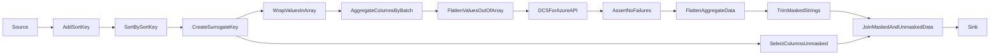
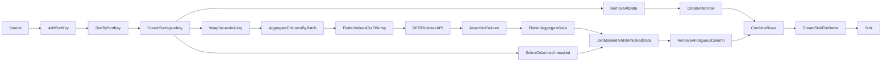

# Unfiltered Masking Dataflow

The masking dataflow is used to consume unmasked data from a source location, mask the data leveraging Delphix
Compliance Services APIs, and prepare it to be written to a sink location.

This dataflow requires several parameters that are computed leveraging the metadata store via the masking parameters
dataflow. These parameters are based on the database schema, the table sizes, the data types, the applied algorithms,
and other factors. Populating the data needed for these parameters to be computed correctly is done via the profiling
pipeline.

## Structure

The general flow of the data in the dataflow is as follows:

* `Source` - Data Source - Select source data at `DF_SOURCE_SCHEMA`.`DF_SOURCE_TABLE` using an inline dataset
* `AddSortKey` - Derived Column - Create column `DELPHIX_COMPLIANCE_SERVICE_SORT_ID` that consists of SHA of the
data across all columns in the table - every row will have this value and it cannot be null
* `SoryBySortKey` - Sort - Sort the table by the value in `DELPHIX_COMPLIANCE_SERVICE_SORT_ID`, as we need the
table to be in a particular order before we apply a surrogate key
* `CreateSurrogateKey` - Surrogate Key - Add a `DELPHIX_COMPLIANCE_SERVICE_BATCH_ID` column that
increments by `1` and starts at `1` after applying the sorting
* `WrapValuesInArray` - Derived Column - For each column we wish to mask, convert the value into an array, this
is needed to preserve `null` values as `null` when using `collect`, as `null` values become `[]`
* `AggregateColumnsByBatch` - Aggregate - For each column we wish to mask, aggregate to a list using `collect`,
grouped by `DELPHIX_COMPLIANCE_SERVICE_BATCH_ID` modulo `DF_NUMBER_OF_BATCHES` - so there will be
`DF_NUMBER_OF_BATCHES` total such aggregations, name the group as `DELPHIX_COMPLIANCE_SERVICE_BATCH_GROUP`
* `FlattenValuesOutOfArray` - Derived Column - For each column we wish to mask, flatten the value out of the
array, in the case where the value was previously `[]`, it becomes `null`
* `DCSForAzureAPI` - External Call - Call DCS for Azure services, using `/v1/masking/batchMaskByColumn`,
where the data from the `FlattenValuesOutOfArray` is included in the request body, and the following headers are
included in the request:
  * `'Run-Id'` - Used for tracing requests
  * `'Field-Algorithm-Assignment'` - Defines the algorithm to apply to which field, defined in
    `DF_FIELD_ALGORITHM_ASSIGNMENT`
  * `'Fail-On-Non-Conformant-Data'` - Defines failure behavior if a non-conformant data error is encountered, driven by
    parameter `DF_FAIL_ON_NONCONFORMANT_DATA`
  * `'Field-Date-Format'` - Defines the date format to apply to which field, defined in `DF_FIELD_DATE_FORMAT`
The format of the response is defined in `DF_BODY_TYPE_MAPPING`
* `AssertNoFailures` - Assert - Confirm that we received a `200` response status from the API request
* `FlattenAggregateData` - Flatten - Unroll the API response body into named columns
* `TrimMaskedStrings` - Derived Column - For each column with a string type, trim the string to length based on
the value in `DF_TRIM_LENGTHS` - this is needed as masking a string may produce a longer string that exceeds the column
width in the sink
* `SelectColumnsUnmasked` - Select - Select only columns that don't require masking
* `JoinMaskedAndUnmaskedData` - Join - Inner join on `SelectColumnsUnmasked` and `TrimMaskedStrings` based on
matching `DELPHIX_COMPLIANCE_SERVICE_BATCH_ID`
* `Sink` - Sink - Sink results of masking to data store by sinking the unrolled results of the masking call to
the columns of the same name in the data sink

### ADLS Delimited Modifications

As delimited files do not have an inherent order to the columns output, additional elements of the dataflow are added to
preserve column ordering. In this case, the data flow appears as follows:

All other steps whose letters exist above are the same, new steps are as follows:
* `Source` - Source - Select source data in source container `DF_SOURCE_CONTAINER`, and wildcard that is
constructed based on `DF_SOURCE_DIRECTORY`, `DF_SOURCE_PREFIX`, and `DF_SOURCE_TABLE` using an inline dataset, with
`DF_COLUMN_DELIMITER`, `DF_QUOTE_CHARACTER`, `DF_ESCAPE_CHARACTER`, and `DF_NULL_VALUE` as specified in the parameters,
and storing the file name in `DELPHIX_COMPLIANCE_SERVICE_FILE_NAME`
* `AddSortKey` - Derived Column - as above
* `SoryBySortKey` - Sort - as above
* `CreateSurrogateKey` - Surrogate Key - as above
* `RemoveAllData` - Filter - To preserve the order of the columns, we will remove all rows from the table by
filtering on `false()`
* `CreateAlterRow` - Alter Row - Add an alter row condition so that all rows will be inserted into the existing
  table with the correct column order
* `CreateSurrogateKey` - Surrogate Key - as above
* `SelectColumnsUnmasked` - Select - as above
* `WrapValuesInArray` - Derived Column - as above
* `AggregateColumnsByBatch` - Aggregate - For each column we wish to mask, aggregate to a list using `collect`,
grouped by `DELPHIX_COMPLIANCE_SERVICE_BATCH_ID` using `DF_TARGET_BATCH_SIZE` to distribute the table into as many
batches as are required to place the target number of rows in each batch, name the group as
`DELPHIX_COMPLIANCE_SERVICE_BATCH_GROUP`
* `FlattenValuesOutOfArray` - Derived Column - as above
* `DCSForAzureAPI` - External Call - as above
* `AssertNoFailures` - Assert - as above
* `FlattenAggregateData` - Flatten - as above
* `JoinMaskedAndUnmaskedData` - Join - as above
* `RemoveAmbiguousColumn` - Select - Since both `FlattenAggregateData` and `SelectColumnsUnmasked` have a column
`DELPHIX_COMPLIANCE_SERVICE_BATCH_ID`, we need to remove that column, so select all columns whose name isn't
`DELPHIX_COMPLIANCE_SERVICE_BATCH_ID`
* `CombineRows` - Union - Union the output of `RemoveAmbiguousColumn` with the empty `CreateAlterRow` table, and
performing the union by name
* `CreateSinkFileName` - Derived Column - Create column `DELPHIX_COMPLIANCE_SERVICE_SINK_FILE_NAME` by replacing
`DF_SOURCE_DIRECTORY` with `DF_SINK_DIRECTORY` in the value in `DELPHIX_COMPLIANCE_SERVICE_FILE_NAME`
* `Sink` - Sink - Sink results of masking to data store by sinking all columns but
`DELPHIX_COMPLIANCE_SERVICE_BATCH_ID`, `DELPHIX_COMPLIANCE_SERVICE_SORT_ID`, and `DELPHIX_COMPLIANCE_SERVICE_FILE_NAME`
to the data sink, naming the file as `DELPHIX_COMPLIANCE_SERVICE_SINK_FILE_NAME`, and using the same metadata settings
as were used in the source with `DF_COLUMN_DELIMITER`, `DF_QUOTE_CHARACTER`, `DF_ESCAPE_CHARACTER`, and `DF_NULL_VALUE`